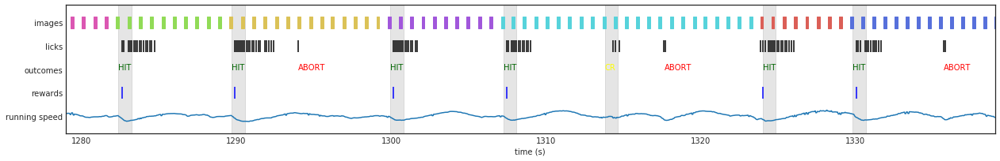

Back to [Projects List](../../README.md#ProjectsList)

# Change is the only constant

## Key Investigators

- @neuromusic Justin Kiggins, Allen Institute for Brain Science
- @matchings Marina Garrett, Allen Institute for Brain Science

# Project Description

Extensions & tutorials for storing operant conditioning data with calcium imaging. This project will use data generated for the Allen Institute's Brain Observatory: Visual Behavior as the primary use case to develop NWB files for behavior training stages and Optical Physiology sessions:

### Objectives
- NWB files for each stage of behavior training for Brain Observatory: Visual Behavior
- NWB files for one Change Detection + Optical Physiology session

## Approach and Plan

Change Detection Datastream
1. Extensions for Operant Conditioning data
1. If not sufficiently supported by (1), extensions for the Change Detection task
1. Develop extensions or existing objects to store the following: Visual Stimulus (images and full field gratings), Lick Events, Water Events, Running Speed (and raw Encoder data)

Optical Physiology Datastream
1. Store Optical Physiology data

## Progress and Next Steps

Progress

1. Saved optical physiology data to NWB file
2. Saved record of visual stimuli (images) to NWB file
3. Read out calcium traces from NWB file
4. Read out visual stimuli from NWB file

Next steps
1. Define extension for Operant Conditioning Data

# Illustrations

# Background and References
