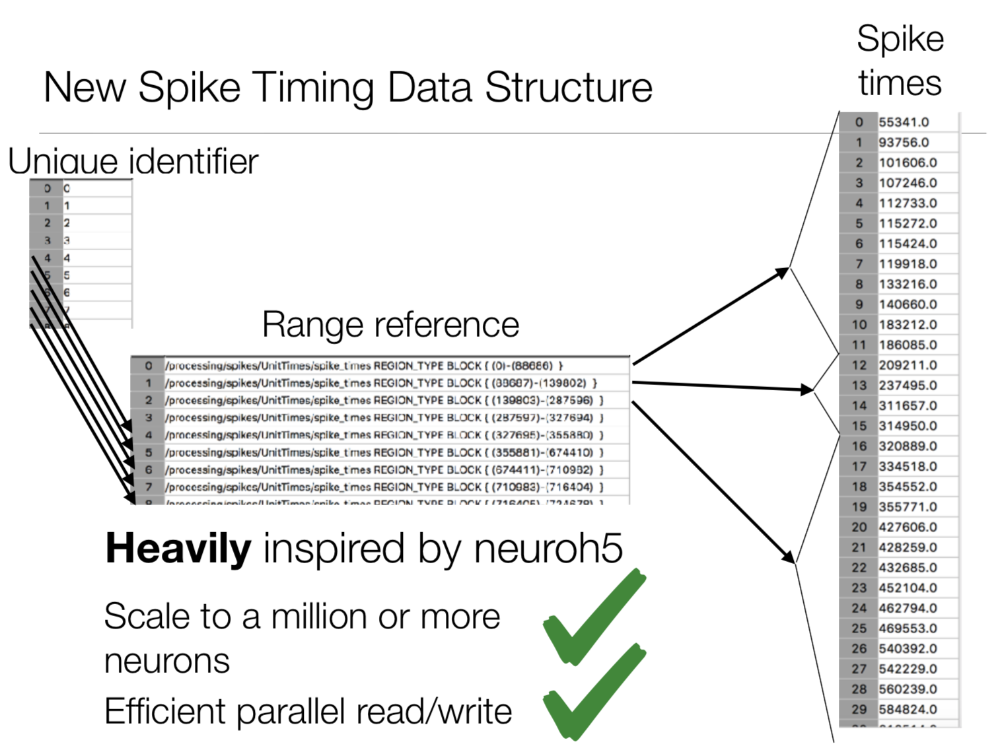
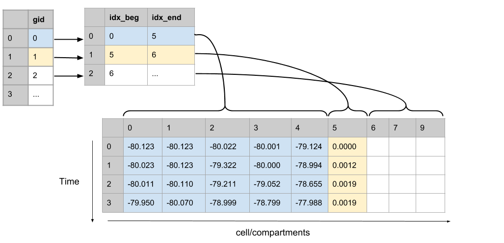

Back to [Projects List](../../README.md#ProjectsList)

# Storage of large-scale network simulation output

## Key Investigators

- Kael Dai (Allen Institute) @kaeldai
- Ben Dichter (Stanford Lab) @bendichter
- Yazan Billeh (Allen Institute) @CellAssembly

# Project Description

An efficent, parallizable way to store the results, and even the input, of large-scale in-silico network simulations.

## Objective

1. Create an extension for storing and reading discrete single unit simulation data (ie spike times from a biophysical/point network simulation).
2. Create an extension for continuous data (ie membrane potential, calcium conc). 
   * May have to create a second extension for multi-compartment reporting (ie membrane potential along all sections of the dentrites)

## Approach and Plan

### Spike time recordings.
Goals: We want to be able to save spike trains from a simulation of anywhere between hundreds to millions of different cells. The previous way to do this was given every cell their own dataset.

While simple to understand, having to open a dataset handle for every possible cell in the network didn't scale well. For the new format, we store all spikes in a single file, using an index table link a given spike time with a cell gid.

### Multicell, multicompartment continuous data storage
Goals:
* Store cell variable data (membrane potential, [Ca++], etc), collected during a simulation
* Multiple cells
* Individual cells may be made up of different sections (soma, axon, dendritic branches) potentially needing to be stored.
* Want to be able to write/read in parallel.
* Want to be able to chunk data by time or by cell

Conceptural Framework:
* Index table stores range of segment ids.
* Stores relative recording position of each cell segment.

Segment recordings from each cell are stored in a single TimeSeries 

## Progress and Next Steps
* Need to be able to use region references as a more explict way of indexing tables.

* Critical: we need to be able to preallocate memory blocks and write in chunks (and to take advantage of MPI).

<!--Describe progress and next steps in a few bullet points as you are making progress.-->

# Illustrations

<!--Add pictures and links to videos that demonstrate what has been accomplished.-->

<!---->

<!---->

# Background and References

<!--Use this space for information that may help people better understand your project, like links to papers, source code, or data.-->

- Forum: https://github.com/orgs/NeurodataWithoutBorders/teams/networkoutput
- Source code: https://github.com/NeurodataWithoutBorders/nwb_hackathons/tree/master/HCK04_2018_Seattle/Projects/NetworkOutput
