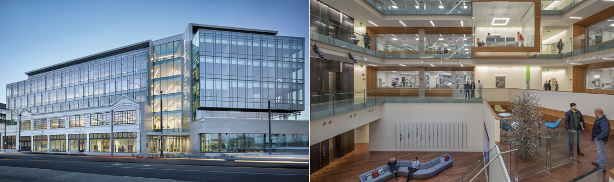

# NWB Hackathon #4

## Logistics

- **Dates:** April 3 (12:00 PM)-6 (3:00 PM), 2018.
- **Location:** [Allen Institute for Brain Science, Seattle, WA](https://www.google.com/maps/place/Allen+Institute/@47.6251853,-122.3412859,17z/data=!3m1!4b1!4m5!3m4!1s0x5490150705cb5703:0x499c58d72a7bcf9!8m2!3d47.6251817!4d-122.3390919). 

- **REGISTRATION:** No fees. Use [this form](https://docs.google.com/forms/d/e/1FAIpQLSfBJXXxNkAaiBcPJJRV67v2R1aFu2L5ZOPzXkt_edSi5UAoVA/viewform) to register. Deadline 2/16/2018.

- **Hotel:** A hotel block will be reserved and information provided after registration.

- **Transportation:** Please use public transportation or park at a local garage. There will be no parking permits.

- **Communication:**
  - To receive information about this and future events please join the [Hackathon mailing list](https://groups.google.com/forum/#!forum/nwb_hackathon_announcements)
  - To ask questions specific to this event, participate in the [Hackathon forum](https://github.com/orgs/NeurodataWithoutBorders/teams/hck04/discussions) on GitHub. It will be available only after registering and being added to the NeurodataWithoutBorders GitHub organization.

## Table of Contents

  * [Logistics](#logistics)
  * [Preparatory Videoconferences](#preparatory-videoconferences)
  * [Local Organizing Committee](#local-organizing-committee)
  * [Program](#program)
  * [Projects](#projects-how-to-add-a-new-project)
  * [Breakout Sessions](#breakout-sessions)
  * [Next Hackathon](#next-hackathon)
  * [Registrants](#registrants)
  * [Frequently Asked Questions](#frequently-asked-questions)
    * [What?](#what)
    * [When, where, how much?](#when-where-how-much)
    * [How does it work?](#how-does-it-work)
    * [Who can attend?](#who-can-attend)
    * [What is the history of NWB hackathons?](#what-is-the-history-of-nwb-hackathons)
    * [Who to contact?](#who-to-contact)

<!--
Created by [gh-md-toc](https://github.com/ekalinin/github-markdown-toc)
-->

## Preparatory Videoconferences

- Video Hangouts Link: *TBD*
- Conference call notes are available [here](PreparatoryMeetingsNotes.md).

## Local Organizing Committee

- Lynne Becker
- Lydia Ng
- Nick Cain
- Justin Kiggins

## Additional Organizational Support
- The Kavli Foundation

## Program

<iframe src="https://calendar.google.com/calendar/embed?src=kitware.com_ahhdp7hjcota17juvara05luc4%40group.calendar.google.com&ctz=America%2FSeattle&dates=20180403%2F20180406&hours=0800%2F2000&mode=WEEK" style="border: 0" width="800" height="600" frameborder="0" scrolling="no"></iframe>

[How to add this calendar to your own?](Calendar/README.md)

## Projects [(How to add a new project?)](Projects/README.md)

<a name="ProjectsList"/>

1. [Experimental Structure Viewer](Projects/ExperimentalStructureViewer/README.md) (Roni Choudhury, Nicholas Cain, and others)
1. [Neuropixels](Projects/Neuropixels) (Josh Siegle, Xiaoxuan Jia, Nile Graddis)
2. [ChangeIsTheOnlyConstant](Projects/ChangeIsTheOnlyConstant) (Justin Kiggins, Marina Garrett)
1. [SlicerDicer](Projects/SlicerDicer) (Doruk Ozturk, and others)
1. [GalleryOfExamples](Projects/GalleryOfExamples) (Andrew Tritt, Oliver Ruebel, Jean-Christophe Fillion-Robin, and others)
1. [ExtensionSharing](Projects/ExtensionSharing) (Andrew Tritt, Oliver Ruebel, Jean-Christophe Fillion-Robin, and others)
1. [Advanced Data I/O](Projects/AdvancedIO) (Oliver Ruebel, Andrew Tritt, and others)
1. [Storage of large-scale network simulation output](Projects/NetworkOutput) (Kael Dai, Ben Dichter, Yazan Billeh, and others)
1. [PatchmasterToNWBConverter](Projects/PatchmasterToNWBConverter) (Sándor Bordé)
1. [StimulusMetadata](Projects/StimulusMetadata) (Luke Campagnola)
1. [SpatialCoordinates](Projects/SpatialCoordinates) (Luke Campagnola)
1. [NWB Explorer](Projects/NWBExplorer) (Matteo Cantarelli, Giovanni Idili)
<a name="BreakoutSessions"/>

## Breakout Sessions

- [Contributing to PyNWB, CI, and Development Process](https://github.com/NeurodataWithoutBorders/nwb_hackathons/blob/master/HCK04_2018_Seattle/Breakouts/Dev/README.md)
- [Visualization](https://github.com/NeurodataWithoutBorders/nwb_hackathons/tree/master/HCK04_2018_Seattle/Breakouts/Visualization)
- [Read API](https://github.com/NeurodataWithoutBorders/nwb_hackathons/blob/master/HCK04_2018_Seattle/Breakouts/readAPI/README.md)
- [User Adoption](https://github.com/NeurodataWithoutBorders/nwb_hackathons/tree/master/HCK04_2018_Seattle/Breakouts/UserAdoption)

## Next Hackathon

[5th Hackathon, April 25-29, 2018, Berkeley](../HCK05_2018_Berkeley/README.md)

## Registrants

Do not add your name to this list - it is maintained by the organizers based on your registration.

<!-- ORGANIZERS: please edit REGISTRANTS.md -->



## Frequently Asked Questions

#### What?

The [Neurodata Without Borders: Neurophysiology][nwb-neurophysiology] (NWB:N) Hackathon is a hands-on activity lasting several days in which neurophysiology researchers create solutions using the open source NWB:N software packages.

Participants work collaboratively on solutions that use the NWB unified data format for cellular-based neurophysiology
data, which is focused on the dynamics of groups of neurons measured under a large range of experimental conditions.
In contrast to conferences and workshops where the primary focus is to report results, the objective of the Hackathon
is to provide a venue for creators and users of neurophysiology open-source software to collaboratively work on any
related research projects.

[nwb-neurophysiology]: http://www.nwb.org/nwb-neurophysiology/

#### When, where, how much?

This year there will be a development focused
Hackathon in Early April in Seattle, and then a user on-boarding tutorial Hackathon in late April in Berkeley.
Ad-hoc meetings are added occasionally. We plan to have at least one more Hackathon in 2019. For this first
Hackathon, breakfast and lunch will be covered and there will be no registration fee. These logistics are expected
to evolve with the Hackathons.

[namic-and-3d-slicer-experience]: http://www.spl.harvard.edu/publications/item/view/3004

#### How does it work?

[Weekly videoconferences](#preparatory-videoconferences) for preparation begin 8-12 weeks before an event. Potential participants propose projects during these meetings, and collaboratively create a list of projects that are of mutual interest. The projects include platform work, algorithm development, analytics, visualization, and neurophysiology applications and
research tasks. Projects are not limited to code development, but can include creation of documentation and tutorial
materials. 

Through the course of the preparatory meetings, each participant selects one or more project teams and develops goals
for the Hackathon. The first day of the Hackathon itself begins with a 2-hour in-person introduction to all projects
and participants. The rest of the Hackathon consists of a mix of working sessions and breakout sessions on special
topics, as decided by the participants during the preparatory meetings.

The projects should be something that can largely be accomplished in a few days, ideally fun, and can help your lab make progress on your research goals. The projects will be written up at the end in a publicly accessible resource that can be used by the community and can be referenced on grant proposals and reports. Projects could be coding, documentation, or tutorials.

Email announcements notifying of upcoming Hackathons are sent to the low-frequency Hackathon mailing list [Hackathon mailing list][hackathon-mailing-list] (for continuity and permanence
across hackathons), and communication specific to each event will happen on a dedicated Hackathon forum (see each
Hackathon page for details).

[hackathon-mailing-list]: https://groups.google.com/forum/#!forum/nwb_hackathon_announcements

#### Who can attend?

Due to limited space the hackathons participation is currently on an invitation-only basis. If
you are interested in attending a hackathon then please contact the organizer of the hackathon directly. We are
always excited to see new members join the NWB:N community. If space is available, we will try to accomodate the additional requests.

#### What is the history of NWB hackathons?

The NWB:N team consists of neuroscientists and software developers
who recognize that creation and adoption of a unified data format is an important step toward breaking down the
barriers to data sharing in neuroscience. Hackathons are a way for us to collaborate and develop NWB:N as well
as to engage with the NWB:N user community.  For an overview of NeurodataWithoutBorders see http://nwb.org/.

As part of the development of NWB:N 1.x two hackathons were held at Janelia Farm, in Ashburn, Virginia; the first
hackathon  on November 20 – 22, 2014 and the second one on May 14-16 at, 2015 (http://crcns.org/NWB/). As part of
the development of NWB:N 2.0 a first hackathon was held at Janelia Farm, in Ashburn, Virginia  on July 31 - August 1, 2017.
The primary focus of the first three hackathons has been on development of the NWB:N format as well as on development of a software strategy for NWB:N.

To encourage the development, growth and use of NWB:N as a unified data format for cellular-based neurophysiology
data, the Allen Institute for Brain Science, Lawrence Berkeley National Lab, and Kitware are organizing a
development-focused hackathon at the Allen Institute for Brain Science (April 3-6, 2018) and a user-engagement
and training hackathon at Lawrence Berkeley National Laboratory (April 25-27).

#### Who to contact?

Communication specific to this event will happen on a dedicated Hackathon forum (see [Logistics](#logistics) for details).
