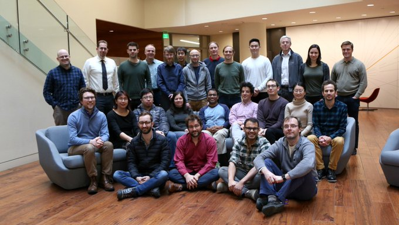

# Welcome to the web page for the 7th NWB Hackathon!

## Table of Contents

  * [Dates and Location](#dates-and-location)
  * [Logistics](#logistics)
  * [Organizing Committee](#organizing-committee)
  * [Additional Organizational Support](#additional-organizational-support)
  * [Attendees](#attendees)
  * [Agenda](#agenda)
  * [Projects](#projects)
  * [Breakout Sessions](#breakout-sessions)
  * [Next Hackathon](#next-hackathon)
  * [Disclaimer](#disclaimer)

## Dates and Location

- **Dates:** Mon, Feb. 3 (12:00 PM) -- Thur. Feb. 6 (3:00 PM), 2020.
- **Location:** [Allen Institute for Brain Science, Seattle, WA](https://www.google.com/maps/place/Allen+Institute/@47.6251853,-122.3412859,17z/data=!3m1!4b1!4m5!3m4!1s0x5490150705cb5703:0x499c58d72a7bcf9!8m2!3d47.6251817!4d-122.3390919).
- **Registration:** Registration for this event is closed!

<!--This event is centered around core NWB development and is per-invitation only. Space at the event is limited. If you did not receive an invitation but would like to attend then please contact the organizaing committee. If you have been invited and will be joining us, then please complete the registration form available [here](https://nam12.safelinks.protection.outlook.com/?url=https%3A%2F%2Fforms.gle%2FNy5jYhwoQffKUjtQ9&data=02%7C01%7C%7Cde03e0e83ddb43e7492b08d77774816a%7C32669cd6737f4b398bddd6951120d3fc%7C0%7C0%7C637109214572629580&sdata=8O73uCbojxRsvVb7%2BWZKPySQojM9CMMVxip056391Go%3D&reserved=0)  by **December 20, 2019**.-->

## Logistics

- **Hotel:** The Allen Institute has organized a special rate at the Staybridge Suites, just 3 blocks from the institute. If you did not reserve your room at the Staybridge Suites before January 3, the cutoff date for the hotel block, you may still be able to make a reservation with the hotel at the usual rate. Other nearby hotels include the Even Hotel, Courtyard Mariott Downtown/South Lake Union, and Residence Inn South Lake Union.
- **Transportation:** Please use public transportation or park at a local garage. There will be no parking permits. Additional details on getting to the Allen Institute are available [here](https://alleninstitute.org/events-training/getting-allen-institute/).
- **Food:** Lunch is provided at the Allen Institute. Breakfast and dinner are on your own. See [here](breakfast_and_dinner.md) for a suggestions for breakfast and dinner locations.

## Organizing Committee

- **Site Chair:** Lydia Ng and Pam Baker (Allen Institute for Brain Science)
- **Program Chair:** Oliver Ruebel (Lawrence Berkeley National Laboratory)

## Additional Organizational Support
- The Kavli Foundation
- Allen Institute for Brain Science

## Attendees

<!-- ORGANIZERS: please edit REGISTRANTS.md -->



## Agenda

<!-- ORGANIZERS: please edit AGENDA.md -->



## Projects

For instructions on how to create a project see [here](projects/README.md)



## Breakout Sessions



## Next Hackathon

In addition to this development-focused Hackathon, there will be additional NWB community events taking place in 2020, including an [NWB tutorial](http://www.cosyne.org/c/index.php?title=Tutorial_2020) prior to the Cosyne 2020 meeting in Denver on February 26 and the [8th NWB:N Developer and User Days Hackathon](https://neurodatawithoutborders.github.io/nwb_hackathons/HCK08_2020_Janelia/) at HHMI Janelia from May 6-9. Several other events for 2020 are also currently in the planning process. For up-to-date information on upcoming events please see our NWB events page [here](https://www.nwb.org/nwb-events/).

## Disclaimer

This website and related content were prepared as an account of or to expedite work sponsored at least in part by the United States Government. While we strive to provide correct information, neither the United States Government nor any agency thereof, nor The Regents of the University of California, nor the Allen Institute for Brain Science, nor any of their employees, makes any warranty, express or implied, or assumes any legal responsibility for the accuracy, completeness, or usefulness of any information, apparatus, product, or process disclosed, or represents that its use would not infringe privately owned rights.

Reference herein to any specific commercial product, process, business, or service by its trade name, trademark, manufacturer, or otherwise, does not necessarily constitute or imply its endorsement, recommendation, or favoring by the United States Government or any agency thereof, or The Regents of the University of California, or the Allen Insitiute for Brain Science. Use of the NWB, LBNL, Allen Institute, or University’s name for endorsements is prohibited.

The views and opinions of authors expressed herein do not necessarily state or reflect those of the United States Government or any agency thereof or The Regents of the University of California or the Allen Institute for Brain Science. Neither Berkeley Lab nor its employees are agents of the US Government. Berkeley Lab web pages link to many other websites. Such links do not constitute an endorsement of the content or company and we are not responsible for the content of such links.
