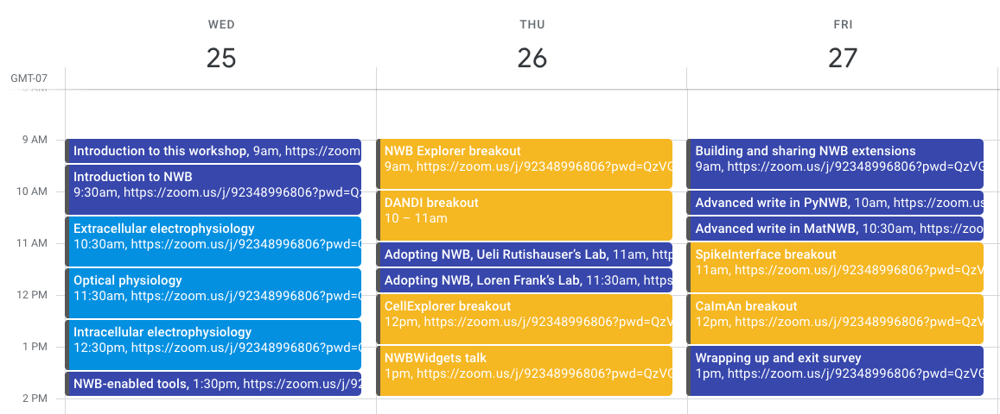

We strongly encourage you to attend at least Day 1 for an introduction to NWB and NWB software tools. 

Agenda (times in PT (UTC-7))

**Aug 25: Day 1 - New user training**

9 - 10:30am: Introduction to this training and to NWB - Oliver Ruebel

Choose one or more:
* 10:30 - 11:30: Introduction to writing extracellular electrophysiology - Ryan and Ben
* 11:30 - 12:30: Introduction to optical physiology - Ryan and Ben
* 12:30 - 1:30: Introduction to intracellular electrophysiology - Oliver, Pam and Ben

1:30 - 2: Overview of NWB-enabled tools

**Aug 26: Day 2 - Project hacking with help from devs**

9am - 10am: NWB Explorer - Padraig Gleeson

10am - 11: DANDI Archive - Yaroslav Halchenko

11 - 11:30: Adopting NWB, Ueli Rutishauser’s Lab - Ueli Rutishauser

11:30 - 12: Adopting NWB, Loren Frank’s Lab - Kyu Hyun Lee

12 - 1: CellExplorer - Peter Petersen, Buzsaki Lab

1 - 2: NWBWidgets - Ben Dichter

**Aug 27: Day 3 - Advanced training**

9 - 10am: Building and sharing NWB extensions - Ryan Ly

10 - 10:30: Advanced write in PyNWB - Matthew Avaylon

10:30 - 11: Advanced write in MatNWB - Ben Dichter

11 - 12: SpikeInterface - Alessio Buccino

12 - 1: CaImAn - Andrea Giovannucci

1 - 2: Wrapping up and exit survey - Oliver Ruebel

You can add this [Google Calendar](https://calendar.google.com/calendar/u/0?cid=MjIxZmRsbGZhOW8xbDJwcDZ2bG1nYmN0NWdAZ3JvdXAuY2FsZW5kYXIuZ29vZ2xlLmNvbQ) to your personal calendar to see the workshop sessions in your time zone.

