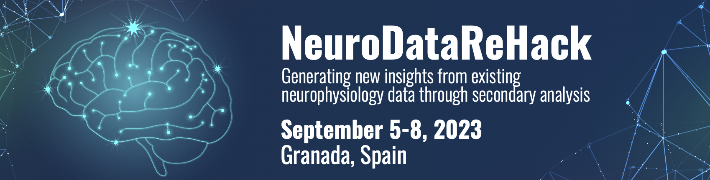

# NeuroDataReHack 2023
## *Generate new insights from existing neurophysiology data through secondary analysis*

* [Report](#report)
* [Dates and Location](#dates-and-location)
* [Objective](#objective)
* [Eligibility](#eligibility)
* [Application](#application)
* [Logistics](#logistics)
* [Organizing Committee](#organizing-committee)
* [Resources](#resources)
* [What to bring?](#what-to-bring)
* [Schedule](#schedule)
* [Disclaimer](#disclaimer)

## Report

The final report for NeuroDataReHack 2023 is now available online at  [[PDF (GitHub)](report/Report__NeuroDataReHack_2023.pdf)] [[LaTeX (Overleaf)](https://www.overleaf.com/read/gzpkpyzcrvfr#1400b0)].

## Dates and Location

- **Dates:** September 5-8, 2023
- **Location:** [Hotel Andalucia Center in Granada, Spain](https://www.hotelescenter.es/en/hotel-andalucia-center-granada/)
  ([google maps](https://goo.gl/maps/rufpp3g39Aefnj289))

## Objective
[The DANDI Archive](http://dandiarchive.org) now has 110+ neurophysiology datasets in the 
[Neurodata Without Borders](http://nwb.org) format  spanning many species, brain  areas, task types, and imaging 
modalities. These include high-value datasets, e.g. from The Allen Institute, the MICrONS project, and the 
International Brain Laboratory, as well as diverse contributions from neuroscience labs around the world. In this 
workshop, we will teach attendees about the open neurophysiology datasets available on the DANDI Archive and train 
them on how to maximally utilize the archive and the NWB standard to incorporate existing data into their scientific 
workflows. Feedback from attendees will be used to improve the software and data standard to better enable 
reanalysis workflows.

Prior to the workshop, we are organizing [Open Neurodata Showcase](../HCK16_2023_OpenNeuroDataShowcase/README.md) where attendees can meet the contributors
behind the neurophysiology datasets and explore virtual posters. Visit the [event page](../HCK16_2023_OpenNeuroDataShowcase/README.md#application) to sign up
and read more about this feature event.

Example projects include but are not limited to:
* Determine whether your result is present in another species or brain area.
* Showcase the capabilities of your tool or analysis on existing data from another lab.
* Explore follow-up questions to a study.

Following the event, participants will be invited to apply for a Kavli Foundation Neurodata Discovery Award, which 
awards $50,000 (USD) of funding to continue data reanalysis projects that come out of the NeuroDataReHack event. Details about the Kavli Foundation Neurodata Discovery Award will be provided closer to the event. 

This event is held as a satellite of the [IBRO World Congress 2023](http://ibro2023.org) with the goal of making 
it more accessible to diverse participants who might not otherwise have the opportunity to participate in this
workshop. Attendance of IBRO 2023 is not a requirement for application.

This event will primarily focus on analyzing existing data in NWB and on DANDI, **not** converting data to NWB. If 
you are interested in learning how to convert data, consider signing up for an NWB User Days event.

## Eligibility

This course is intended for PhD students, postdoctoral researchers, principal investigators, or similar.
Applicants should have basic programming experience in Python or MATLAB and experience with neurophysiology research.

## Application

**Applications are now closed.** 

Space for the event is limited. Apply to attend NeuroDataReHack 2023 [here](https://forms.gle/akaThWFBJrv7udev9). 

* Application deadline: May 8
* Notification of admission decisions: June 1

## Logistics

Thanks to the generous sponsorship of The Kavli Foundation, this event will be free to participants:
* There is no registration or application fee.
* Participants will be provided a private room at the Hotel Andalucia Center Hotel for the duration of this event, 
  checking in on Monday, September 4 and checking out on Saturday, September 9th, the day that the IBRO conference 
  starts. **Note that we previously stated that check out would be on Friday, September 8th.**
* Breakfast, lunch, dinner, and coffee breaks will be provided.
* You will be responsible for booking your own flight to the event. If you need financial assistance for travel, 
  consider applying for an [IBRO travel grant](https://ibro.org/world-congress-travel-grants/), which can be used to
  arrive early for this event. The deadline for travel grant applications is March 28.
* You will be responsible for determining visa and/or healthcare requirements for travel to Spain.

## Organizing Committee

**Program chairs:**
* Benjamin Dichter, CatalystNeuro
* Oliver Rübel, Lawrence Berkeley National Laboratory
* Ryan Ly, Lawrence Berkeley National Laboratory
* Stephanie Albin, The Kavli Foundation

## Resources

Resources will be posted here to help participants prepare for the event.

* A report of the first NeuroDataReHack event: ([PDF](../HCK14_2022_Seattle_RH/report/Report_Neurodata_Rehack_v2.pdf))
* Recordings of talks will be made available on the [NWB Youtube channel](https://www.youtube.com/channel/UCfD_mU-EFz135a9TpNFJP5A).

## What to bring?

Bring a laptop with appropriate software installed. Python should be installed and MATLAB is optional. For 
instructions on how to install PyNWB, see 
[the PyNWB documentation](https://pynwb.readthedocs.io/en/stable/install_users.html#installing-pynwb). For instructions
on how to install MatNWB, see
[the MatNWB documentation](https://github.com/NeurodataWithoutBorders/matnwb/blob/master/README.md)

## Schedule
Tentative schedule:

[PDF](AgendaNeuroDataReHack2023.pdf)

## Disclaimer

This website and related content were prepared as an account of or to expedite work sponsored at least in part by 
the United States Government. While we strive to provide correct information, neither the United States Government 
nor any agency thereof, nor The Regents of the University of California, nor any of their employees, makes any 
warranty, express or implied, or assumes any legal responsibility for the accuracy, completeness, or usefulness of 
any information, apparatus, product, or process disclosed, or represents that its use would not infringe privately 
owned rights.

Reference herein to any specific commercial product, process, or service by its trade name, trademark, manufacturer, 
or otherwise, does not necessarily constitute or imply its endorsement, recommendation, or favoring by the United 
States Government or any agency thereof, or The Regents of the University of California.  Use of the Laboratory or 
University’s name for endorsements is prohibited.

The views and opinions of authors expressed herein do not necessarily state or reflect those of the United States 
Government or any agency thereof or The Regents of the University of California.  Neither Berkeley Lab nor its 
employees are agents of the US Government.

Berkeley Lab web pages link to many other websites.  Such links do not constitute an endorsement of the content or 
company and we are not responsible for the content of such links.
