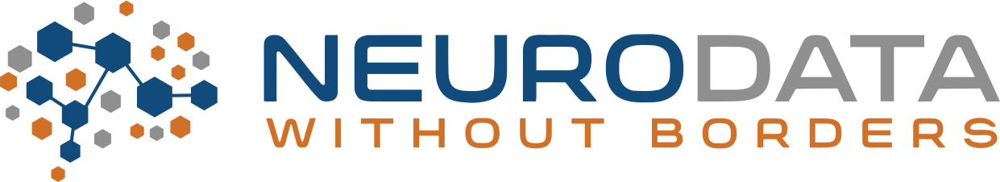

# Welcome to the 2024 NWB Developer Hackathon hosted by DataJoint!

  * [Report](#report)
  * [Overview](#overview)
  * [Dates and Location](#dates-and-location)
  * [Registration](#registration)
  * [Logistics](#logistics)
  * [Organizing Committee](#organizing-committee)
  * [Objective](#objective)
  * [Agenda](#agenda)
  * [Projects](#projects)
  * [Code of Conduct](#code-of-conduct)

## Report

The final report for the 2024 NWB Developer Hackathon is now available on GitHub ([PDF](report/Report_18th_NWB_Developer_Hackathon.pdf)) ([LaTeX (on Overleaf)](https://www.overleaf.com/read/zcdnqtcmwgpv#d964cb)).

## Overview

The Neurodata Without Borders (NWB) team is organizing a hackathon event for developers.
In contrast to our NWB user training workshops, this event is focused on bringing together the developers of the
NWB data standard and software ecosystem and developers of community tools who would like to integrate their tools
with NWB. This hackathon will enable participants to work intensively on an NWB-related project with the assistance of
the NWB development team and others in the community. Together, we can develop and discuss ideas for solving technical
problems that impact the broader community. Our goal is to foster collaboration and community among developers.

This is our first NWB hackathon event hosted by DataJoint. Working in the DataJoint building and with their team will facilitate projects at the intersection between DataJoint and NWB, such as Spyglass or building NWB export for custom DataJoint pipelines. We also welcome NWB projects that are not related to DataJoint.

## Dates and Location

- **Dates:** Wednesday, April 17, 2024, 9 AM to Friday, April 19, 2024, 5:30 PM
- **Location:** DataJoint headquarters, [4265 San Felipe St #1025, Houston, TX 77027](https://www.google.com/maps/place/4265+San+Felipe+St+%231025,+Houston,+TX+77027/data=!4m2!3m1!1s0x8640c15d907d761d:0x38a7f7a077419384?sa=X&ved=2ahUKEwih_8ykk_GAAxVzEEQIHb_sBvIQ8gF6BAgcEAA&ved=2ahUKEwih_8ykk_GAAxVzEEQIHb_sBvIQ8gF6BAgdEAI)

We encourage participants to stay at the hackathon until Friday at 5:30 PM to participate in the final project presentations.

Immediately prior to the NWB Developer Hackathon, DataJoint will be organizing the SciOps Summit 2024 at the same location.
If you are interested in this DataJoint event, we encourage you to register for it as well.

DataJoint will also be organizing a social mixer event on Tuesday, April 16 at 5:30 PM
for DataJoint workshop participants to mix with NWB Developer Hackathon participants. We encourage participants to arrive early
enough on Tuesday to attend this mixer.

You can start attending the event(s) on different days for different experiences:

- NWB Developer Hackathon only: Join Wednesday to Friday
- SciOps Summit 2024 and NWB Developer Hackathon: Join Monday to Friday

## Registration

[Register for the NWB Developer Hackathon](https://try.datajoint.com/nwb-hackathon2024)

You can also register for the SciOps Summit 2024 [here](https://try.datajoint.com/sciops-summit-2024).

## Logistics

### Housing

Housing support is not provided. We recommend booking housing at the
[Hampton Inn Houston-Near The Galleria](https://www.hilton.com/en/hotels/houpohx-hampton-houston-near-the-galleria/),
which is a short walk to the event.

### Travel

Travel support is not provided. Limited funds are available to support attendee travel. Once attendance has been
confirmed, we will contact you to collect additional information regarding your travel details. Please see the
[Dates and Location](#dates-and-location) section above for information on when you are expected to arrive and depart
the hackathon.

### Dining

Meals will not be provided.

## Organizing Committee

**Site Chair:** Kushal Bakshi

**Program chairs:** [Ryan Ly](https://crd.lbl.gov/divisions/scidata/mla/staff/ryan-ly/) and [Ben Dichter](http://bendichter.com/)

## Objective

The [Neurodata Without Borders](https://www.nwb.org/) project is an effort to standardize the description and storage of neurophysiology data and metadata. NWB enables data sharing and reuse and reduces the energy barrier to applying data analytics both within and across labs. NWB has seen wide adoption in the neurophysiology community, and there are now over 175 datasets on the DANDI Archive in NWB, including data from the Allen Institute and the International Brain Laboratory.

The NWB Developer Hackathon will bring neuroscientists, tool builders, and research software engineers together to further the development of the NWB software ecosystem, including the data standard, core software packages, official tools, and community tools. Members of the community will exchange ideas and best practices for using NWB and the libraries, share NWB based tools, surface common needs, solve bugs, make feature requests, brainstorm about future funding and collaboration, and make progress on current blockages.

**Note:** This event is meant to foster community and collaboration around NWB, not competition. As such, this is really more of a “workshop” than a “hackathon.” There will be no judges or prizes. Participants will be expected to bring their own software tool or data, other relevant project, and/or collaborate with others to build integration with NWB.

## Agenda



## Projects

Please add your project ideas and document your project progress in the [**Hackathon Projects Google Doc**](https://docs.google.com/document/d/1stHuLJf4Id5itoFjCsS2W5XatwWw7tZhZSTYJT2ZC4g/edit)

To create a new project, simply:

* Open the project Google Doc. If you are participating and do not have edit access, then please contact Ryan via email or Slack to request access.
* Make a copy of the project template section and add it to the end of the document
* Update at least your project’s title, key investigators, and project description sections

## Code of Conduct

Please see the [Code of Conduct](https://neurodatawithoutborders.github.io/nwb_hackathons/code_of_conduct) for all NWB events.

## Disclaimer

This website and related content were prepared as an account of or to expedite work sponsored at least in part by
the United States Government. While we strive to provide correct information, neither the United States Government
nor any agency thereof, nor The Regents of the University of California, nor any of their employees, makes any
warranty, express or implied  or assumes any legal responsibility for the accuracy, completeness, or usefulness of
any information, apparatus, product, or process disclosed, or represents that its use would not infringe privately
owned rights. Reference herein to any specific commercial product, process, or service by its trade name, trademark,
manufacturer, or otherwise, does not necessarily constitute or imply its endorsement, recommendation, or favoring by
the United States Government or any agency thereof, or The Regents of the University of California.  Use of the
Laboratory or University’s name for endorsements is prohibited. The views and opinions of authors expressed herein
do not necessarily state or reflect those of the United States Government or any agency thereof or The Regents of
the University of California.  Neither Berkeley Lab nor its employees are agents of the US Government. Berkeley Lab
web pages link to many other websites.  Such links do not constitute an endorsement of the content or company and we
are not responsible for the content of such links.
