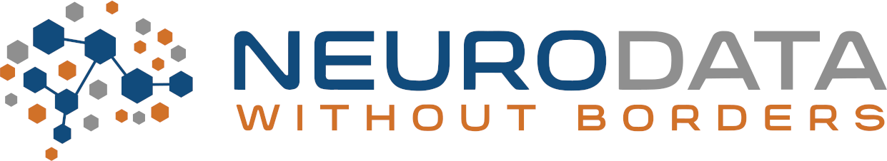

# NWB Data Conversion Workshop 2024

  * [Dates and Location](#dates-and-location)
  * [Registration](#registration)
  * [Logistics](#logistics)
  * [Organizing Committee](#organizing-committee)
  * [Resources](#resources)
  * [What to bring?](#what-to-bring)
  * [Objective](#objective)
  * [Agenda](#agenda)
  * [Code of Conduct](#code-of-conduct)
  * [Disclaimer](#disclaimer)
  

## Dates and Location

- **Dates:** June 12-14, 2024
- **Location:** Virtual

## Registration

Register for the event [here](https://forms.gle/pTsjRMEqsgCRo3VD8).

## Logistics

We will be using Gather and Zoom for the meeting and will send an email in the days before the workshop with links.

## Organizing Committee

**Program chair:**  [Steph Prince](https://crd.lbl.gov/divisions/scidata/computational-biosciences/members/staff/stephanie-prince/) and [Oliver Rübel](https://crd.lbl.gov/divisions/scidata/mla/staff/oliver-ruebel/)

## What to bring?

* Please bring any example datasets you would like to convert. For lab-specific data (i.e., data not in these [supported formats](https://nwb-guide.readthedocs.io/en/latest/format_support.html)), you should ideally have scripts for reading the data using Python or MATLAB.
* Bring your laptop with appropriate software installed. For installation instructions see:
  * [**NWB GUIDE**](https://nwb-guide.readthedocs.io/en/latest/installation.html)
  * [**PyNWB (Python)**](https://pynwb.readthedocs.io/en/stable/install_users.html)
  * [**MatNWB (Matlab)**](https://neurodatawithoutborders.github.io/matnwb/)
* For an overview of NWB software, see also: 
  * [**Glossary of Core NWB Tools**](https://nwb-overview.readthedocs.io/en/latest/core_tools/core_tools_home.html) 
  * [**Glossary of Analysis and Visualization Tools**](https://nwb-overview.readthedocs.io/en/latest/tools/analysis_tools_home.html)
* For an overview of NWB see the [**NWB Overview Docs**](https://nwb-overview.readthedocs.io)

## Objective

The [Neurodata Without Borders](nwb.org) project is an effort to standardize the description and storage of neurophysiology
data and metadata. NWB enables data sharing and reuse and reduces the energy barrier to applying data analytics both within
and across labs. NWB has seen wide adoption in the neurophysiology community, and there are now over 100 datasets on the
DANDI Archive in NWB, including data from the Allen Institute and the International Brain Laboratory.

The NWB Data Conversion Workshop will train members of the neuroscience community on how to convert their data to NWB and 
publish it on the DANDI Archive. We will train attendees starting from the basics of the NWB format and proceeding to 
domain-specific tutorials and advanced data engineering techniques to maximally utilize the features of the HDF5 and Zarr 
backends. During this workshop, we will introduce multiple sets of tools with varying levels of flexibility for converting
 your data, including NWB GUIDE, a new no-code user interface for data conversion.

**Note:** All levels of experience are welcome! We will have tutorials ranging from no-code, automated data conversion to 
more advanced, custom code conversion.

## Agenda



## Code of Conduct

Please see the [Code of Conduct](https://neurodatawithoutborders.github.io/nwb_hackathons/code_of_conduct) for all NWB events.

## Disclaimer

This website and related content were prepared as an account of or to expedite work sponsored at least in part by 
the United States Government. While we strive to provide correct information, neither the United States Government 
nor any agency thereof, nor The Regents of the University of California, nor any of their employees, makes any 
warranty, express or implied  or assumes any legal responsibility for the accuracy, completeness, or usefulness of 
any information, apparatus, product, or process disclosed, or represents that its use would not infringe privately 
owned rights. Reference herein to any specific commercial product, process, or service by its trade name, trademark, 
manufacturer, or otherwise, does not necessarily constitute or imply its endorsement, recommendation, or favoring by 
the United States Government or any agency thereof, or The Regents of the University of California.  Use of the 
Laboratory or University’s name for endorsements is prohibited. The views and opinions of authors expressed herein 
do not necessarily state or reflect those of the United States Government or any agency thereof or The Regents of 
the University of California.  Neither Berkeley Lab nor its employees are agents of the US Government. Berkeley Lab 
web pages link to many other websites.  Such links do not constitute an endorsement of the content or company and we 
are not responsible for the content of such links.

