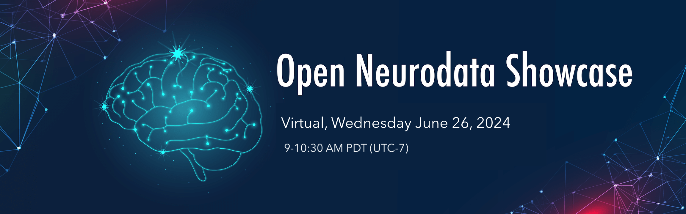

# Open Neurodata Showcase 2024
## *Meet the scientists who have publicly shared neurophysiology data.*

* [Dates and Location](#dates-and-location)
* [Objective](#objective)
* [Eligibility](#eligibility)
* [Application](#application)
* [Virtual Data Showcase Agenda](#agenda)
* [Organizing Committee](#organizing-committee)
* [Disclaimer](#disclaimer)

## Dates and Location

- **Dates:** July 2, 9 - 10:30AM PDT (UTC-7) 2024
- **Location:** Virtual in Gather (link to be shared closer to the event date)

## Objective
[The DANDI Archive](http://dandiarchive.org) now has 199+ neurophysiology datasets in the 
[Neurodata Without Borders](http://nwb.org) format  spanning many species, brain  areas, task types, and imaging 
modalities. These include high-value datasets, e.g. from [Allen Institute OpenScope](https://dandiarchive.org/dandiset/search?search=openscope), the [MICrONS project](https://dandiarchive.org/dandiset/000402), and the 
[International Brain Laboratory Brain Wide Map](https://dandiarchive.org/dandiset/000409), as well as diverse contributions from neuroscience labs around the world.

In this event, we organize a virtual poster session in the Gather platform to bring together data contributors
and anyone interested in reusing existing neurophysiology data.
This virtual event offers a unique opportunity for participants to engage in discussions, explore dandisets, 
and allows data contributors to showcase their projects.

## Eligibility

This virtual event is open to anyone interested in neurophysiology data, including but not limited to:
* Neuroscience graduate students, post-docs, and other researchers interested in using open data in their research
* Educators who want to use real datasets in their lessons
* Undergraduates and high school students interested in learning about neuroscience
* Open science advocates

## Application

If you are interested in **attending** the event, register [here](https://forms.gle/amPd4h5kN9BPLX4g7). 

If you are interested in **presenting** your dandiset(s), register as a presenter at Open Neurodata Showcase 2024 [here](https://forms.gle/FwMEEtvQUtzFiEhg7).

## Virtual Data Showcase Agenda

| Session                                   | Speakers          | Time: Pacific |
|-------------------------------------------|-------------------|---------------|
| Gather space opens to participants        |                   | 8:55am        |
| Introduction to the virtual data showcase | Organizers        | 9:00-9:20am   |
| Virtual poster session                    | Data Contributors | 9:20-10:30am  |

## Presenters
* Saskia de Vries, "Allen Institute Observatory - Visual Coding Calcium Imaging Datasets", [DANDI:000728](https://dandiarchive.org/dandiset/000728/draft), [DANDI:000039](https://dandiarchive.org/dandiset/000039), [DANDI:000049](https://dandiarchive.org/dandiset/000049)
* Alessio Buccino, "SpikeInterface, a unified framework for spike sorting", [DANDI:000034](https://dandiarchive.org/dandiset/000034/0.211030.0713)
* Xinyue Ma, "Patch-seq recordings from mouse visual cortex", [DANDI:000020](https://dandiarchive.org/dandiset/000020/0.210913.1639)
* Olivier Winter, "IBL - Brain Wide Map" and "IBL behavioral data", [DANDI:000409](https://dandiarchive.org/dandiset/000409), [DANDI:000045](https://dandiarchive.org/dandiset/000045), [DANDI:000049](https://dandiarchive.org/dandiset/000049)
* Michael Kyzar, "Data for: Control of working memory maintenance by theta-gamma phase amplitude coupling of human hippocampal neurons" and "Dataset of human-single neuron activity during a Sternberg working memory task.", [DANDI:000673](https://dandiarchive.org/dandiset/000673), [DANDI:000469](https://dandiarchive.org/dandiset/000469)
* Kevin Le, "Data for: Multimodal single-neuron, intracranial EEG, and fMRI brain responses during movie watching in human patients", [DANDI:000623](https://dandiarchive.org/dandiset/000623)
* Carolina Filipe, "Neurotask Benchmark Datasets", [DANDI:001055](https://dandiarchive.org/dandiset/001055),, [DANDI:001056](https://dandiarchive.org/dandiset/001056), [DANDI:001057](https://dandiarchive.org/dandiset/001057), [DANDI:001058](https://dandiarchive.org/dandiset/001058), [DANDI:001059](https://dandiarchive.org/dandiset/001059), [DANDI:001060](https://dandiarchive.org/dandiset/001060)

## Organizing Committee

**Program chairs:**
* Alessandra Trapani, CatalystNeuro
* Anna Szonja Weigl, CatalystNeuro
* Benjamin Dichter, CatalystNeuro
* Oliver Rübel, Lawrence Berkeley National Laboratory
* Ryan Ly, Lawrence Berkeley National Laboratory
* Stephanie Albin, The Kavli Foundation

## Disclaimer

This website and related content were prepared as an account of or to expedite work sponsored at least in part by 
the United States Government. While we strive to provide correct information, neither the United States Government 
nor any agency thereof, nor The Regents of the University of California, nor any of their employees, makes any 
warranty, express or implied, or assumes any legal responsibility for the accuracy, completeness, or usefulness of 
any information, apparatus, product, or process disclosed, or represents that its use would not infringe privately 
owned rights.

Reference herein to any specific commercial product, process, or service by its trade name, trademark, manufacturer, 
or otherwise, does not necessarily constitute or imply its endorsement, recommendation, or favoring by the United 
States Government or any agency thereof, or The Regents of the University of California.  Use of the Laboratory or 
University’s name for endorsements is prohibited.

The views and opinions of authors expressed herein do not necessarily state or reflect those of the United States 
Government or any agency thereof or The Regents of the University of California.  Neither Berkeley Lab nor its 
employees are agents of the US Government.

Berkeley Lab web pages link to many other websites.  Such links do not constitute an endorsement of the content or 
company and we are not responsible for the content of such links.
