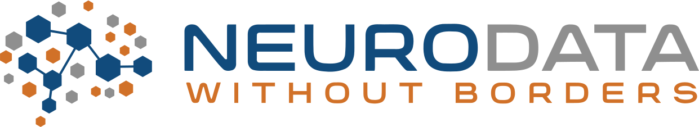

# NWB Docathon 2025

  * [Dates and Location](#dates-and-location)
  * [Objective](#objective)
  * [Registration](#registration)
  * [Logistics](#logistics)
  * [Resources](#resources)
  * [What to bring?](#what-to-bring)
  * [Agenda](#agenda)
  * [Code of Conduct](#code-of-conduct)
  * [Disclaimer](#disclaimer)
  

## Dates and Location

- **Dates:** May 1-2, 2025
- **Location:** Virtual

## Objective

The [Neurodata Without Borders](nwb.org) project is an effort to standardize the description and storage of neurophysiology
data and metadata. NWB enables data sharing and reuse and reduces the energy barrier to applying data analytics both within
and across labs. NWB has seen wide adoption in the neurophysiology community, and there are now over 300 datasets on the
DANDI Archive in NWB, including data from the Allen Institute and the International Brain Laboratory.

One of the goals of NWB is to ensure that members of the neuroscience community have the resources and tools to easily 
interact with their data. We are hosting a dedicated docathon to invite members of the community to join us in updating, 
improving, and expanding our documentation. The goal of this workshp is to make sure our documentation is up-to-date and 
accessible to new and existing users of NWB.

Many types of contributions are welcome, including updates to:
* tutorials
* how-to guides
* docstrings
* user documentation
* developer documentation
* recorded demo videos

If you cannot attend but there is an a particular gap or aspect of the documentation you think could use improvement, 
please submit a documentation issue on the relevant GitHub repo.

**Note:** All levels of experience are welcome! We have several existing open issues and welcome new contributors.

## Registration

Register for the event [here](https://forms.gle/5Sewge3qpozxnrATA).

## Logistics

We will be use Zoom for the meeting and will send an email with a link to all registrants.

## What to bring?

* If you have any particular documentation issues you are interested in working on, feel free to open a new issue or 
comment on an existing issue in advance
   * [PyNWB issues](https://github.com/NeurodataWithoutBorders/pynwb/issues?q=is%3Aissue%20state%3Aopen%20label%3A%22topic%3A%20docs%22&page=1) 
   * [MatNWB issues](https://github.com/NeurodataWithoutBorders/matnwb/issues?q=is%3Aissue%20state%3Aopen%20label%3A%22topic%3A%20docs%22)

## Agenda

The tentative agenda is below. All times are in Pacific Time (PT):
* May 1st:
   * 9:00AM - 9:30AM: Introduction to the docathon
   * 9:30AM - 10:00AM: Project discussion
   * 10:00AM - 5:00PM: Documenting / hacking
* May 2nd:
   * 9:00AM - 9:30AM: Project check-in and discussion
   * 9:30AM - 5:00PM: Documenting / hacking

## Code of Conduct

Please see the [Code of Conduct](https://neurodatawithoutborders.github.io/nwb_hackathons/code_of_conduct) for all NWB events.

## Disclaimer

This website and related content were prepared as an account of or to expedite work sponsored at least in part by 
the United States Government. While we strive to provide correct information, neither the United States Government 
nor any agency thereof, nor The Regents of the University of California, nor any of their employees, makes any 
warranty, express or implied  or assumes any legal responsibility for the accuracy, completeness, or usefulness of 
any information, apparatus, product, or process disclosed, or represents that its use would not infringe privately 
owned rights. Reference herein to any specific commercial product, process, or service by its trade name, trademark, 
manufacturer, or otherwise, does not necessarily constitute or imply its endorsement, recommendation, or favoring by 
the United States Government or any agency thereof, or The Regents of the University of California.  Use of the 
Laboratory or University’s name for endorsements is prohibited. The views and opinions of authors expressed herein 
do not necessarily state or reflect those of the United States Government or any agency thereof or The Regents of 
the University of California.  Neither Berkeley Lab nor its employees are agents of the US Government. Berkeley Lab 
web pages link to many other websites.  Such links do not constitute an endorsement of the content or company and we 
are not responsible for the content of such links.

