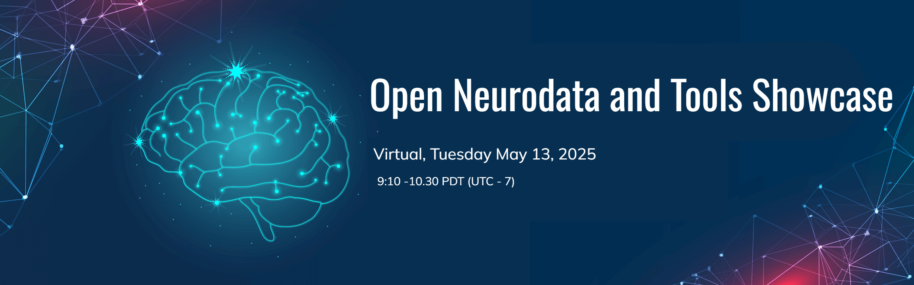

# Open Neurodata and Tools Showcase 2025

* [Dates and Location](#dates-and-location)
* [Objective](#objective)
* [Eligibility](#eligibility)
* [Registration](#registration)
* [Agenda](#agenda)
* [Presenters](#presenters)
* [Organizing Committee](#organizing-committee)
* [Code of Conduct](#code-of-conduct)
* [Disclaimer](#disclaimer)

## Dates and Location

- **Dates:** May 13, 2025, 9:10 - 10:40AM PDT (UTC-7)
- **Location:** Virtual in Gather (link will be shared with registrants)

## Objective
[The DANDI Archive](http://dandiarchive.org) now has 300+ neurophysiology datasets in the 
[Neurodata Without Borders](http://nwb.org) format  spanning many species, brain  areas, task types, and imaging 
modalities. These include datasets from [Allen Institute OpenScope](https://dandiarchive.org/dandiset/search?search=openscope), the [MICrONS project](https://dandiarchive.org/dandiset/000402), and the 
[International Brain Laboratory Brain Wide Map](https://dandiarchive.org/dandiset/000409), as well as diverse contributions from neuroscience labs around the world.

The Open Neurodata and Tools Showcase is a free virtual event in Gather where attendees can meet data contributors and tool developers, explore publicly available neurophysiology datasets in DANDI, and discover open-source tools integrated with the NWB ecosystem. This event provides an opportunity to connect with both dataset creators and tool developers to discuss their work, including open research questions and potential applications.

## Eligibility

This virtual event is open to anyone interested in neurophysiology data and tools, including but not limited to:
* Neuroscience graduate students, post-docs, and other researchers interested in using open data and open-source tools in their research
* Educators who want to use real datasets in their lessons
* Undergraduates and high school students interested in learning about neuroscience software and data
* Open science advocates

## Registration

If you are interested in **attending** the event, register [here](https://forms.gle/rj8gYB92guBMcQZN7). 

If you are interested in **presenting** a dandiset or tool, register as a presenter at Open Neurodata Showcase 2025 [here](https://forms.gle/UQugCAUJqL4jabrR9)

The Neurodata and Tools Showcase is also part of a multi-day NWB Data Conversion workshop. If you are interested in attending these additional sessions to learn more about converting your own data to NWB and publishing on DANDI please register [here](https://forms.gle/5Sewge3qpozxnrATA) and see the [event webpage](../HCK22_2025_DataConversion_Remote/README.md) for more details.

## Virtual Data Showcase Agenda

| Session                                     | Speakers                              | Time: Pacific |
|---------------------------------------------|---------------------------------------|---------------|
| Gather space opens to participants          |                                       | 8:55 am       |
| Introduction to the data and tools showcase | Organizers                            | 9:00-9:10am   |
| Virtual poster session                      | Data Contributors and Tool Developers | 9:10-10:30am  |

## Presenters
* Presenter details will be added at a later date

## Organizing Committee

**Program chairs:**
* Alessandra Trapani, CatalystNeuro
* Stephanie Prince, Lawrence Berkeley National Laboratory
* Benjamin Dichter, CatalystNeuro
* Oliver Rübel, Lawrence Berkeley National Laboratory
* Ryan Ly, Lawrence Berkeley National Laboratory

## Code of Conduct

Please see the [Code of Conduct](https://neurodatawithoutborders.github.io/nwb_hackathons/code_of_conduct) for all NWB events.

## Disclaimer

This website and related content were prepared as an account of or to expedite work sponsored at least in part by 
the United States Government. While we strive to provide correct information, neither the United States Government 
nor any agency thereof, nor The Regents of the University of California, nor any of their employees, makes any 
warranty, express or implied, or assumes any legal responsibility for the accuracy, completeness, or usefulness of 
any information, apparatus, product, or process disclosed, or represents that its use would not infringe privately 
owned rights.

Reference herein to any specific commercial product, process, or service by its trade name, trademark, manufacturer, 
or otherwise, does not necessarily constitute or imply its endorsement, recommendation, or favoring by the United 
States Government or any agency thereof, or The Regents of the University of California.  Use of the Laboratory or 
University’s name for endorsements is prohibited.

The views and opinions of authors expressed herein do not necessarily state or reflect those of the United States 
Government or any agency thereof or The Regents of the University of California.  Neither Berkeley Lab nor its 
employees are agents of the US Government.

Berkeley Lab web pages link to many other websites.  Such links do not constitute an endorsement of the content or 
company and we are not responsible for the content of such links.
