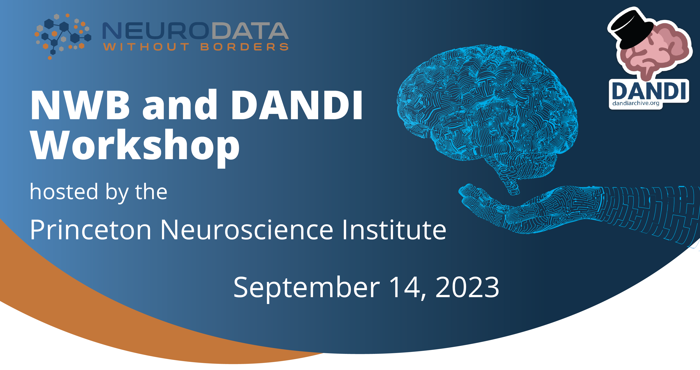

# NWB and DANDI Workshop
## hosted by the Princeton Neuroscience Institute

**Date:** September 14, 1:30 - 5:00 PM

Join us for an interactive workshop on [Neurodata Without Borders (NWB)](https://nwb.org), a data standard for neurophysiology, and the [DANDI Archive](https://dandiarchive.org), a collaboration platform for publishing, sharing, and processing neurophysiology data. Learn how to use these resources to maximize the impact of your data while complying with the new NIH data sharing and management policies.

Representatives from the NWB and DANDI teams, Ryan Ly and Ben Dichter, will provide an overview of the NWB software ecosystem and teach you how to convert data to NWB and publish data on DANDI.

Agenda:

1:30pm - 2:30pm : PNI A32 - Introduction to NWB and DANDI

2:30pm - 3:00pm : Coffee break

3:00pm - 5:00pm : PNI A02 - Interactive workshop on NWB and DANDI

RSVP for the talk and/or workshop [here](https://forms.gle/PnzdqpYW33TQ3Tz7A)
