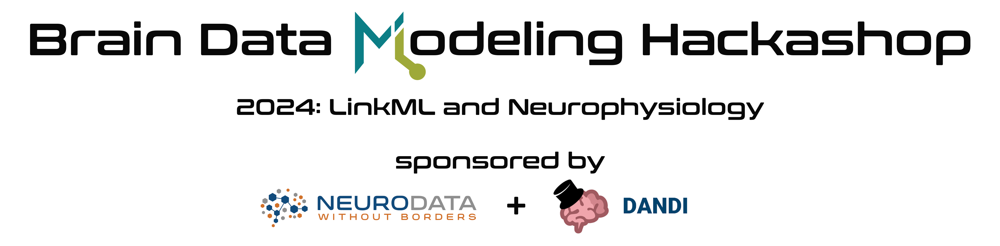
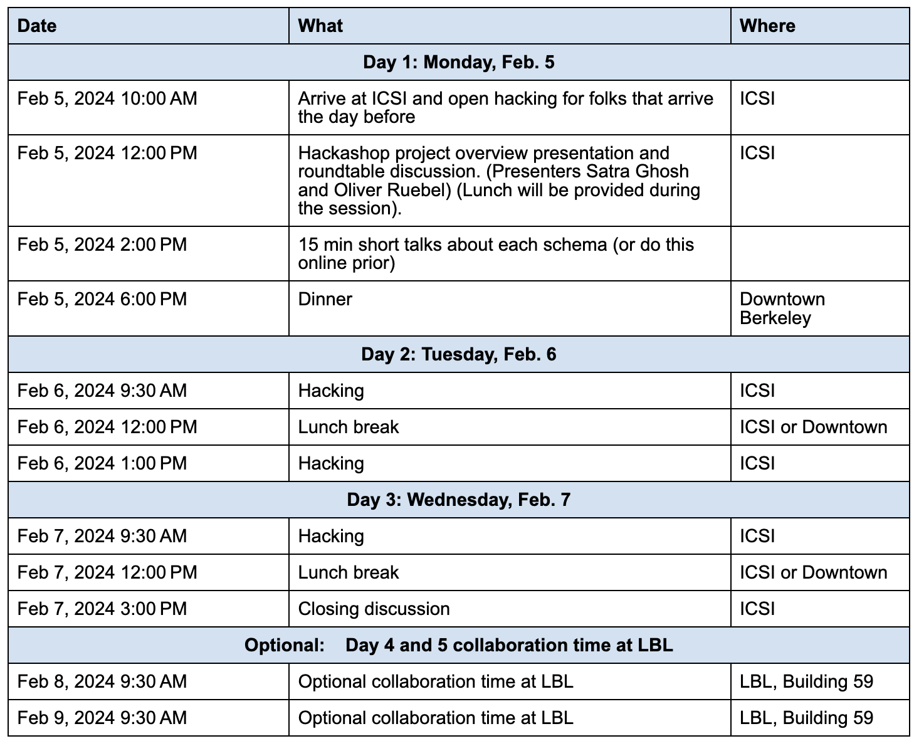

* [Dates & Location](#dates-and-location) 
* [Organizers](#organizing-committee)  
* [Logistics](#logistics) 
* [Agenda](#agenda) 
* [Projects](#projects) 
* [Legal](#legal)

The objective of the event is to bring the neurophysiology data and standards developer community together to evaluate the use of LinkML to create common schema and facilitate integration of data across standards and resources. The goal is to create LinkML based schemas that integrate information across existing efforts in data modeling for neuroscience and leveraging existing standards and resources, e.g, NWB, AIND, OpenMINDS, DANDI, and BICAN. To support large scientific data, a second goal is to extend LinkML for array type data structures required, e.g, for NWB and OME-Zarr. This is an invitation-only event.

## Dates and Location

- **Main Event:** 
    - **Dates:** Feb. 5 - 7, 2024. 
        - **Note:** The main program starts at noon on Feb.5 to allow attendees taking morning flights to be able to get to ICSI on time.
    - **Location:** [International Computer Science Institute (ICSI)](https://www.icsi.berkeley.edu), 2150 Shattuck Ave, Suite 250,  Berkeley, CA 94704

- **Optional Bonus hacking days:** Participants may optionally choose to stay up to 2 extra days to continue working together in a free-form fashion.
    - **Dates:** Feb 8-9, 2024   
    - **Location:** [Building 59 (Shyh Wang Hall)](https://map.lbl.gov/#ctdl-UMAP_2012091840117,BLD_2013013161357), 1 Cyclotron Road, Lawrence Berkeley National Laboratory, Berkeley, CA 

## Organizing Committee

* **Site chair:** [Oliver Rübel](https://crd.lbl.gov/divisions/scidata/computational-biosciences/members/staff/oliver-ruebel-bio/)
* **Program chair:** [Satrajit Ghosh](https://mcgovern.mit.edu/profile/satrajit-ghosh/) 

## Logistics

### Directions
 - **ICSI (Main Event):** ICSI is located in Downtown Berkeley across from the Downtown Berkeley BART station (on the second floor above the CHASE bank), with convenient access to hotels, restaurants, and transit. BART will conveniently get you from the airport to ICSI:
     - **From San Francisco International Airport** Depending on the time you can either take: 1) the Richmond (red) train directly to the Downtown Berkeley station, or 2) the Antioch (yellow) train to 19th Street Oakland and transfer to the Richmond (orange) line (across the platform) to Downtown Berkeley. Transfer time with BART is ~54min.
     - **From Oakland International Airport** Take the BART connector train from the Airport to the Oakland Coliseum station and transfer to the Richmond (orange) train to Downtown Berkeley BART station. 
     - [BART online schedule](https://www.bart.gov/planner)
     - [GoogleMap](https://www.google.com/maps/place/International+Computer+Science+Institute/@37.8700159,-122.2695811,18z/data=!3m2!4b1!5s0x80857e9eacbaf82b:0x71414272a685c989!4m6!3m5!1s0x80857e99566a4815:0x9226568954e914ed!8m2!3d37.8700159!4d-122.2685444!16s%2Fg%2F1vb9d8mq?entry=ttu)
 - **LBNL (Bonus Hacking Days):**  Building 59 (Shyh Wang Hall) is located on the Lawrence Berkeley National Laboratory campus. See the [static](https://www2.lbl.gov/Workplace/lab-site-map.html) and 
   [interactive](https://map.lbl.gov/#ctdl-UMAP_2012091840117,BLD_2013013161357) LBNL site map for details. 
    - **Directions:** From Downtown Berkeley take the Blue LBNL Shuttle to Building 65 and walk up Perlmutter Road (across the road) to get to Building 59. ([Shuttle Schedule](https://commute.lbl.gov/resource/shuttle-buses/maps-routes-schedules/blue-route/))([Interactive Shuttle Map](http://tinyurl.com/fz3fr7jr))

### Housing

Attendees will need to reserve their own lodging. A broad range of hotels and housing options are available in Downtown Berkeley within walking distance from ICSI, e.g:

- [Hotel Shattuck Plaza](https://www.hotelshattuckplaza.com/)
- [Marriot Residence Inn Berkeley](https://www.marriott.com/en-us/hotels/oakrr-residence-inn-berkeley/overview/)

## Agenda

The main program starts at noon on Feb.5 to allow attendees taking morning flights to be able to get to ICSI on time. See [here](https://docs.google.com/document/d/e/2PACX-1vTltxVMTAF4QzTWe3MFddIgdypSlXEwBaSISAowz8cp9okXzRznCatwQNbRGrJGbYCY-0vxf3jEHu2_/pub) for the latest agenda. 

## Projects

To ease collaborative editing of projects we are managing projects in the following Google Docs:

* [**Brain Data Modeling Hackashop Projects 2024**](https://docs.google.com/document/d/1cvIr3FtUtxcsZJXKPbwiNtBctxNxnYnzU1xxSHkyg44/edit?usp=sharing)

## Legal

### Code of Conduct

Please see the [Code of Conduct](https://neurodatawithoutborders.github.io/nwb_hackathons/code_of_conduct) for all NWB events.

### Disclaimer

This website and related content were prepared as an account of or to expedite work sponsored at least in part by 
the United States Government. While we strive to provide correct information, neither the United States Government 
nor any agency thereof, nor The Regents of the University of California, nor any of their employees, makes any 
warranty, express or implied  or assumes any legal responsibility for the accuracy, completeness, or usefulness of 
any information, apparatus, product, or process disclosed, or represents that its use would not infringe privately 
owned rights. Reference herein to any specific commercial product, process, or service by its trade name, trademark, 
manufacturer, or otherwise, does not necessarily constitute or imply its endorsement, recommendation, or favoring by 
the United States Government or any agency thereof, or The Regents of the University of California.  Use of the 
Laboratory or University’s name for endorsements is prohibited. The views and opinions of authors expressed herein 
do not necessarily state or reflect those of the United States Government or any agency thereof or The Regents of 
the University of California.  Neither Berkeley Lab nor its employees are agents of the US Government. Berkeley Lab 
web pages link to many other websites.  Such links do not constitute an endorsement of the content or company and we 
are not responsible for the content of such links.

