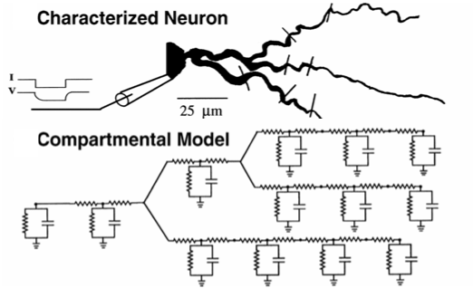
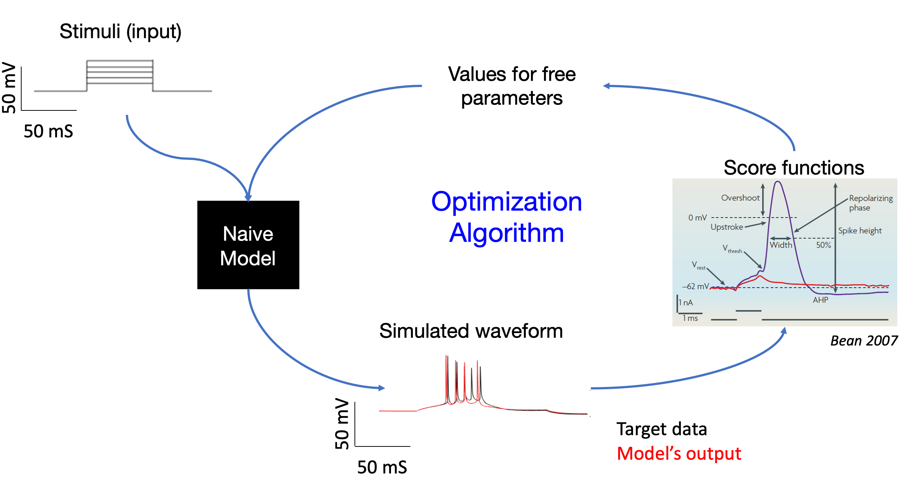

[:rewind: Back to the projects list](../../README.md#ProjectsList)

<!-- For information on how to write GitHub .md files see https://guides.github.com/features/mastering-markdown/ -->

# Neuronal Model Optimization

## Key Investigators
Matthew T. Sit (UC Berkeley)

Roy Ben-Shalom (UCSF, LBNL)

Kevin Bender (UCSF)

## Project Description

We can use a compartmental model to represent neurons. [1]
Further, changes to ion channel distribution or density affect neuronal output.
We ask, what are the distributions of ion channels at the different compartments of the neuron? [2]

We can use a genetic optimization algorithm to fit models to electrophysiological data.
A stimulus and values for free parameters can be inputed to our model to obtain a voltage response
representing the simulated waveform.
We can compare this to the target experimental data using a score function to assess the similarity.
This information can then be used to refine our free parameter values iteratively.
<!-- Add a short paragraph describing the project. -->

## Objectives
In order to constrain the free parameters, we employ the use of large volumes of synthetic data, including
that of stimuli, parameter sets, and voltage responses. The current methodology is to store all this data in
separate csv files, one for each datum instance. The goal is to abandon csv files and to leverage NWB instead.
<!-- Briefly describe the objectives of your project. What would you like to achieve?-->
1. Group Data Appropriately. Identify the correct native NWB data structures available that could be used to
represent our data sets. Define the requirements needed of our NWB files, and determine at what stages of the process
certain kinds of data are available, when are they needed, and what is their relationship with one another.
2. Create Extensions. This will allow for our data to be organized properly, allow for ease of access to needed
pieces of information, and provide self-documenting data structures.
3. Documentation. Provide ample comments in the NWB-specific files, provide helper functions so that lab members
not familiar with NWB can still use our extensions, and provide an example notebook demonstrating intended usage of our extensions.

## Approach and Plan
1. Determine the requirements of our data usage and identify how NWB can meet these criterion.
Identify native NWB data structures to use, and determine the best way to organize our data in NWB.
2. Learn how to develop extensions to ensure that our usage of NWB and our data is self-documenting.
3. Comment code, provide helper functions for non-NWB users, and create an example notebook to demonstrate usage.
<!-- 1. Describe the steps of your planned approach to reach the objectives.-->
<!-- 1. ... -->
<!-- 1. ... -->

## Progress and Next Steps
All three goals have been accomplished as of the weekend following the Hackathon!
The next steps are to integrate usage of NWB into our existing scripts.
We have already integrated into our stimuli generating script.
The next task is to integrate it into our scripts which use Neuron [3] so that it can accept stimuli and parameter sets via NWB, and write its voltage response outputs to NWB as well.
<!--Populate this section as you are making progress before/during/after the hackathon-->
<!--Describe the progress you have made on the project,e.g., which objectives you have achieved and how.-->
<!--Describe the next steps you are planing to take to complete the project.-->

## Materials
Not available at this time.
<!--If available add links to the materials relevant to the project, e.g., the code generated for the project or data used-->
<!--If available add pictures and links to videos that demonstrate what has been accomplished.-->
<!---->

## Background and References
[1] Canavier  & Landry. 2006.

[2] Mainen & Sejnowski. 1996.

[3] https://neuron.yale.edu/neuron/
<!--Use this space for information that may help people better understand your project, like links to papers, source code, or data ,e.g:-->
<!-- - Source code: https://github.com/YourUser/YourRepository -->
<!-- - Documentation: https://link.to.docs -->
<!-- - Test data: https://link.to.test.data -->
